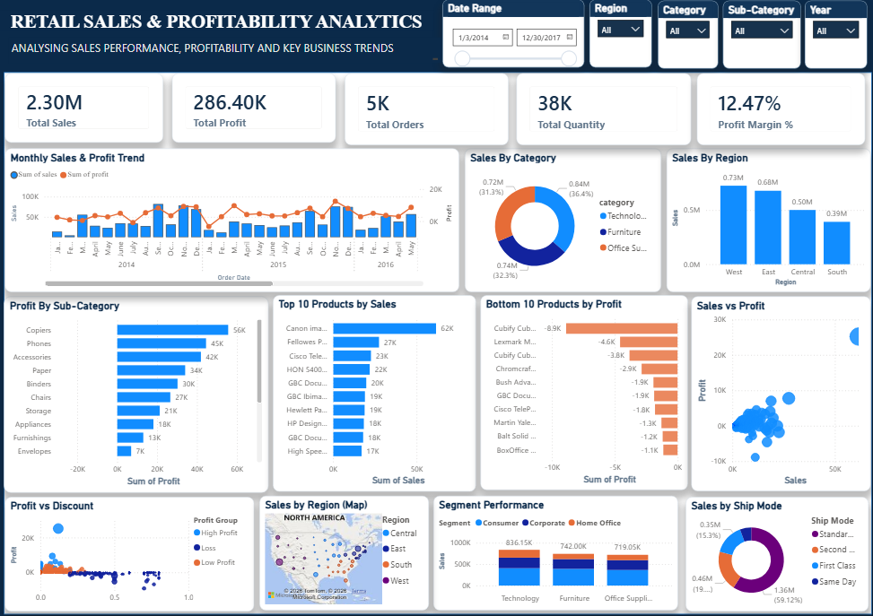

# Retail Sales & Profitability Analytics

An end-to-end data analytics project analyzing retail sales, profitability, product performance, regional performance, customer segments, discounts, and business trends using **Excel, Python, SQL, and Power BI**.

---

## Project Objective

The objective of this project is to analyze retail sales data and identify important business insights related to:

- Sales performance
- Profitability
- Product performance
- Regional performance
- Customer segments
- Discounts
- Sales trends
- Shipping modes

The project follows an end-to-end analytics workflow:

**Excel → Python → SQL → Power BI → GitHub**

---

## Tools & Technologies

- **Excel** – Data cleaning and initial analysis
- **Python** – Exploratory Data Analysis
- **Pandas** – Data manipulation
- **Matplotlib** – Data visualization
- **MySQL** – SQL analysis
- **Power BI** – Interactive dashboard
- **Git & GitHub** – Version control and portfolio

---

##  Dataset

The project uses the Superstore retail sales dataset containing information about:

- Orders
- Customers
- Products
- Categories
- Sub-Categories
- Regions
- Sales
- Quantity
- Discount
- Profit
- Shipping information

**Total Records:** 9,994

---

##  Project Workflow

### 1. Data Cleaning – Excel

Performed initial data quality checks and prepared the dataset for analysis.

Activities included:

- Checking missing values
- Checking duplicate records
- Validating data types
- Cleaning date fields
- Checking numeric values
- Preparing the cleaned dataset

### 2. Exploratory Data Analysis – Python

Python was used to calculate KPIs and analyze business trends.

Key analysis included:

- Overall sales and profit
- Regional performance
- Category performance
- Monthly sales trends
- Profit trends

### 3. Business Analysis – SQL

MySQL was used to answer business questions such as:

- What are the total sales and profit?
- Which category performs best?
- Which region generates the highest profit?
- Which sub-categories are loss-making?
- Which products generate the highest sales?
- Which products generate the lowest profit?
- How does discount relate to profitability?
- How does performance vary by segment and shipping mode?

### 4. Power BI Dashboard

An interactive dashboard was created with:

- KPI Cards
- Monthly Sales & Profit Trend
- Sales by Category
- Sales by Region
- Profit by Sub-Category
- Top 10 Products by Sales
- Bottom 10 Products by Profit
- Sales vs Profit
- Profit vs Discount
- Sales by Region Map
- Segment Performance
- Sales by Ship Mode

### Interactive Filters

- Date Range
- Region
- Category
- Sub-Category
- Year

---

## Key KPIs

| KPI | Result |
|---|---:|
| Total Sales | **$2.30M** |
| Total Profit | **$286.40K** |
| Total Orders | **5,009** |
| Units Sold | **37,873** |
| Profit Margin | **12.47%** |

---

## Key Business Insights

### Category Performance
Technology generated the highest overall sales and profit.

Furniture generated strong sales but comparatively low profitability.

### Regional Performance
The West region generated the highest sales and profit.

The Central region showed comparatively weaker profitability.

### Sub-Category Performance
Tables were identified as a major loss-making sub-category.

Bookcases and Supplies also recorded negative profitability.

### Discount Analysis
Higher discount levels were generally associated with weaker profitability in several discount groups.

This indicates a relationship between discounting and profitability, although correlation does not necessarily imply causation.

### Product Performance
The analysis identified both high-performing products and products generating significant losses.

---

## Dashboard Preview



---

## Project Structure

```text
Retail_Sales_Analytics/
│
├── data/
│   ├── raw/
│   └── cleaned/
│
├── documentation/
│
├── excel/
│
├── powerbi/
│   └── Retail_Sales_Analytics.pbix
│
├── python/
│   └── retail_eda.py
│
├── screenshots/
│
├── sql/
│   └── retail_sales_analytics.sql
│
├── .gitignore
└── README.md